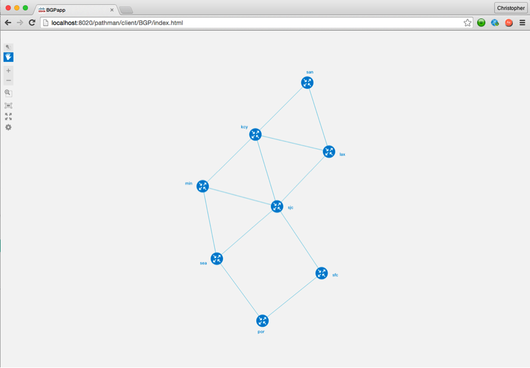
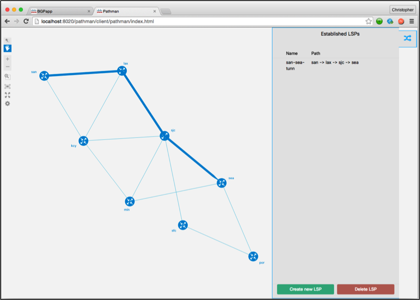

# OpenDaylight BGP and PCEP (Pathman) Apps

OpenDaylight (ODL) is an open-source application development and delivery platform. BGP Link State (BGP-LS) Manager and PCEP (Pathman) Manager are two applications developed to run on top of ODL to visualize topologies and program MPLS traffic engineering (TE) paths.

## Team:

- Chris Metz
- Niklas Montin
- Tyler Levine
- Sergey Madaminov
- Giles Heron
- Aikepaer Abuduweili
- Bimal Grewal

### Project demo Link:

[https://github.com/CiscoDevNet/Opendaylight-BGP-Pathman-apps](https://github.com/CiscoDevNet/Opendaylight-BGP-Pathman-apps)

### Contact Email:

[TBD@external.cisco.com](mailto:TBD@external.cisco.com) 

### Social Tags:

SDN, Open Source, NexT, IP, MPLS, BGP, BGP-LD, OSPF, ISIS, Traffic Engineering, RESTCONF API, YANG

### Project Kick-off Date:

September 2015

### Current Status:

Beta

## Application Overview:

A basic tenet of Software Defined Networking (SDN) involves an application interacting with a network for the purpose simplifying operations or enabling a service. A controller is positioned between the application and network and interacts with network elements (e.g. routers) in the southbound direction using a variety of different protocols. In the northbound direction it present an abstraction of the network using in practice common REST APIs. This innovation supports two applications: BGP-LS Manager and PCEP Manager (aka Pathman).

1 depicts the architecture of the components used in this innovation.

 Figure 1 BGP-LS and PCEP Manager Innovation Architecture

From the bottom-up we have a network of routers running MPLS for label switching packets across the network, and either OSPF or ISIS to maintain and distribute the topology (link-state) database amongst all routers in the network. One of the routers is a BGP-LS and it transports a copy of the topology database to the ODL controller. The routers will also run a PCEP (stands for path computation element protocol) used by the ODL controller to instruct a source router to setup an MPLS traffic engineered path to a destination router. This is very network- and protocol-specific details, which frankly the end-user may not know or care about. This is where OpenDaylight and applications come into play.

Inside of ODL there are YANG models of the network topology and how to configure MPLS TE tunnels on routers. The model-driven service adaptation layer (MD-SAL) takes these models and automatically generates a set of REST APIs (referred to as RESTCONF) that applications can call. BGP-LS Manager is an application that calls the RESTCONF APIs to retrieve and render a visualization of the network viewable through a simple web browser. Pathman is another application calling RESTCONF APIs when the end-user wishes to manage one or more MPLS TE paths in the network, again done through a web browser. The other key component here is the open source NeXt UI framework (based on HTML5/CSS/Javascript) used to generate a crisp representation of the network topology.

2 shows the main panel of the BGP-LS Manager application viewed through a Chrome Browser. We see a network of 8 x routers interconnected in a partial mesh with each router labeled based on configuration. The end-user can click on any router to display additional information.

Figure 2 BGP-LS Manager Application Screen

3 shows the data entry portion of Pathman where the end-user wishes to setup a path from from the SAN router to the SEA router. Upon entering the path source and destination, Pathman will compute all possible paths based on either cost or hop count. The end-user can view each one graphically overlayed on top of the topology (incidentally built using the BGP-LS mechanisms).

Figure 3 Pathman data entry and path selection screen

The end-user selects, names it below and hits the deploy button. In the background ODL will take the information contained in the RESTCONF API call, convert to PCEP protocols and send them down the SAN router that will then setup a path to the SEA router. The result is shown in 4.

Figure 4 Pathman screen showing deployed path

Future enhancements to this project include segment routing support, enhanced topology APIs, multi-area/domain visualizations and ODL release support.

In summary ODL is an application platform abstracting the complexities of a network and presenting a suite of REST API exposed to applications. BGP-LS Manager and Pathman are two applications, one designed to visualize a network topology and other making simple to configure MPLS TE paths across a network.

## Features:

- Developed to run on top of ODL
- Leverages RESTCONF APIs based on BGP and PCEP YANG Models
- Dynamic Visualization of a link-state topology based on BGP-LS
- Enables "point and click" function for establishing MPLS TE tunnels
- Leverages the open source NeXt UI framework for topology visualization
- Source code in HTML5/CSS/Javascript, NeXt and Python
- Option to employ dCloud supporting on-demand virtual ODL and IP/MPLS network provisioning

### References

- [https://wiki.opendaylight.org/view/BGP\_LS\_PCEP:Main](https://wiki.opendaylight.org/view/BGP_LS_PCEP:Main)

- [https://developer.cisco.com/site/neXt/](https://developer.cisco.com/site/neXt/)

- [https://github.com/CiscoDevNet/opendaylight-sample-apps](https://github.com/CiscoDevNet/opendaylight-sample-apps)